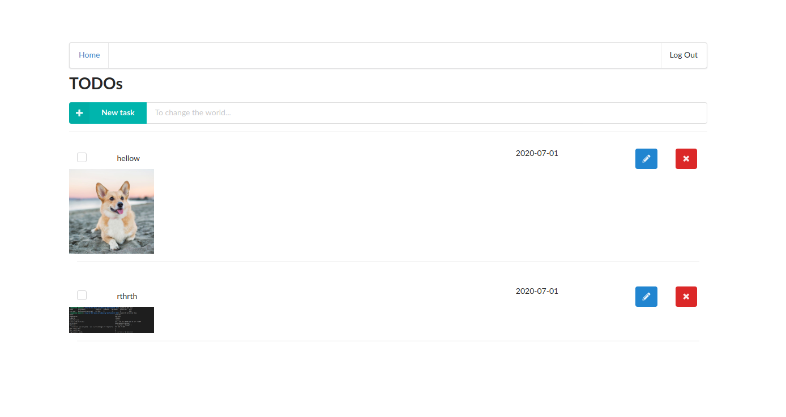

# Serverless TODO

To implement this project, you need to implement a simple TODO application using AWS Lambda and Serverless framework. Search for all comments starting with the `TODO:` in the code to find the placeholders that you need to implement.




### *** To Run the application ***

# How to run the application

## Backend

To deploy an application run the following commands:

```
cd backend
npm install
sls deploy -v
```

## Frontend
docker pull be41zehe/todos-app

docker run --rm -it -p 127.0.0.1:3000:3000 be41zehe/todos-app

The application is deployed on serverless and the application endpoint is included in environments file from client

Frontend can be fired from localhost:3000 in the browser.


In the screenshots folder, a working screenshot is given and tracing enabled is added


# Functionality of the application

This application will allow creating/removing/updating/fetching TODO items. Each TODO item can optionally have an attachment image. Each user only has access to TODO items that is created.

# TODO items

TODO Schema

* `todoId` (string) - a unique id for an item
* `createdAt` (string) - date and time when an item was created
* `name` (string) - name of a TODO item (e.g. "Change a light bulb")
* `dueDate` (string) - date and time by which an item should be completed
* `done` (boolean) - true if an item was completed, false otherwise
* `attachmentUrl` (string) (optional) - a URL pointing to an image attached to a TODO item

The `serverless.yml` file must have DynamoDB table, Lambdas for todo execution, S3 bucket and iamroles with proper permissions and resources.


## Authentication

Auth0 is used as an identity provider to authenticate user into the application.

# Postman collection

To Test the API, you can use the Postman collection that contains sample requests. You can find a Postman collection in this project. The images for postman procedure is given in the images folder.
